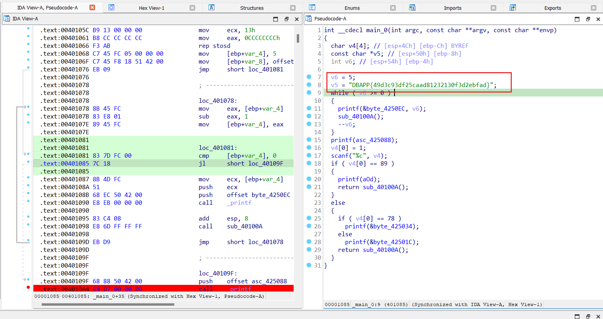

# Connotation Software

**Solve:**

Khi tạo pseudocode thấy có biến `v5` được gán giá trị `DBAPP{49d3c93df25caad81232130f3d2ebfad}`, các phần phía dưới đều làm nhiễu quá trình reverse, nội dung bên trong biến `v5` chính là flag

> **flag:** flag{49d3c93df25caad81232130f3d2ebfad}