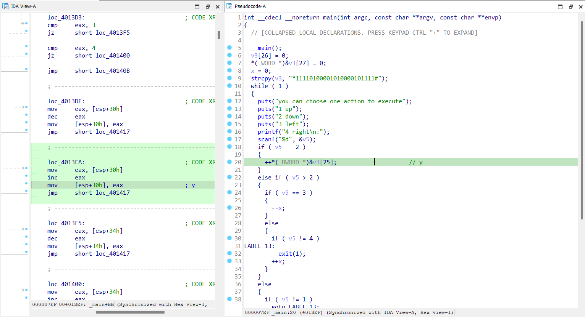
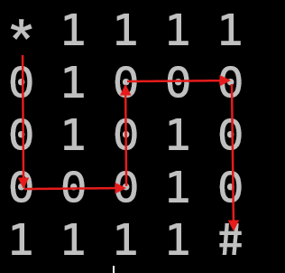
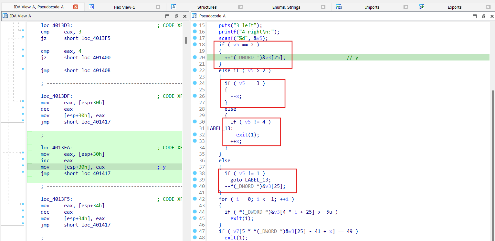
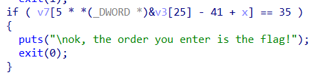

# 不一样的flag

- Đổi tên file PE là `Different_Flag.exe`, khi tạo mã giả C thấy có 1 xâu `v3` chỉ toàn các ký tự `0` và `1`, trong đó có dấu `*` ở đầu và `#` ở cuối. Đồng thời có 1 menu lựa chọn các hướng di chuyển, trông khá giống trò chơi mê cung.

- Độ dài của xâu là 25, có thể đoán đây là mê cung 5x5, với `0` là đường đi, còn `1` là chướng ngại vật không thể đi qua.

- Phân tích kĩ chương trình sẽ thấy luồng hoạt động của các câu lệnh rẽ nhánh, thấy các giá trị được cập nhật như sau:
  - Nếu nhập số 1, giá trị `v3[25]` sẽ được giảm xuống, 2 thì `v3[25]` sẽ tăng lên, tương ứng thì đây là tung độ
  - Nếu nhập 3 và 4 là tăng giảm giá trị `x` tương ứng là hoành độ.
  
  - Sau khi kiểm tra giá trị nhập vào sẽ kiểm tra hoành độ hoặc tung độ xem có nằm ngoài kích thước của mê cung là 5x5 hay không thì sẽ exit chương trình.
  - Để có thể hoàn thành được trò chơi mê cung thì giá trị tại vị trí con trỏ đang đứng phải có giá trị là kí tự `#`. Lúc này chương trình sẽ in ra dòng chữ 'ok, the order you enter is the flag!'
  
- Như vậy, đường đi cần nhập, hay flag chính là chuỗi `222441144222`

> **Flag:** flag{222441144222}