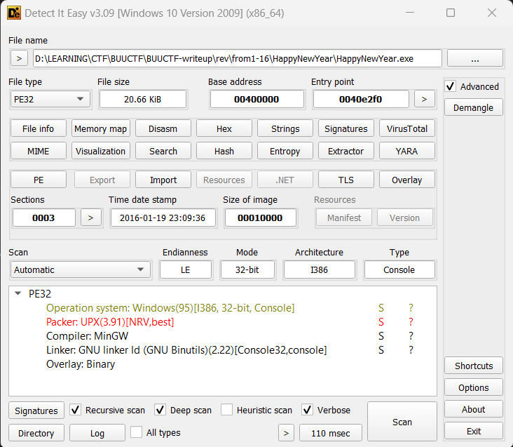
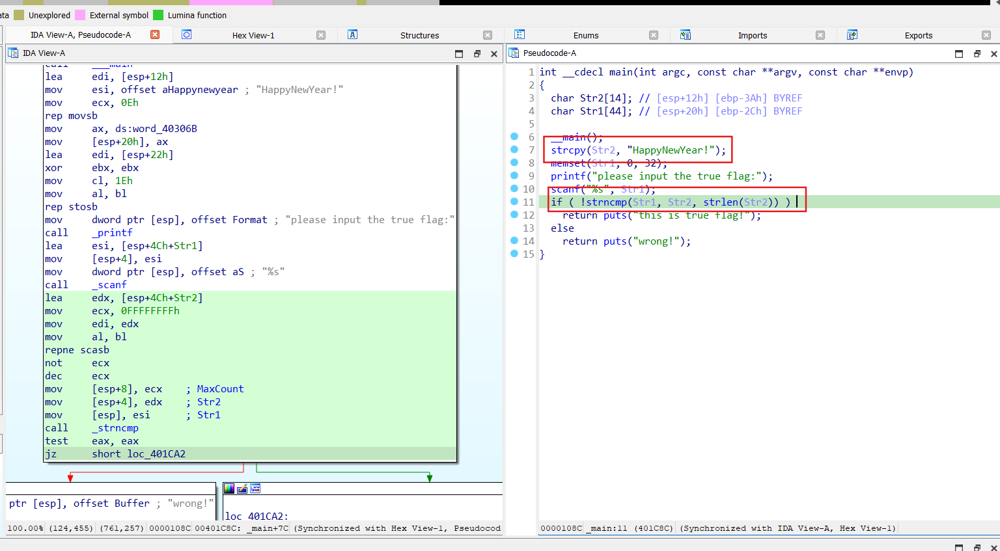

# 新年快乐

> Tên đề bài và tên file là tiếng Trung nên mình sử dụng công cụ dịch thành "HappyNewYear" cho dễ sử dụng

- Đầu tiên, khi load file vào công cụ Detect It Easy, nhận thấy đây là 1 file đã bị pack bởi packer upx

- Tiến hành unpack file rồi load vào IDA Pro

- Theo luồng chương trình, `Str2` là chuỗi dùng để kiểm tra, `Str1` là chuỗi input, cũng chính là flag cần tìm. Flag này không thông qua hàm mã hoá nào nên flag cần tìm là `HappyNewYear!`

> **flag:** flag{HappyNewYear!}