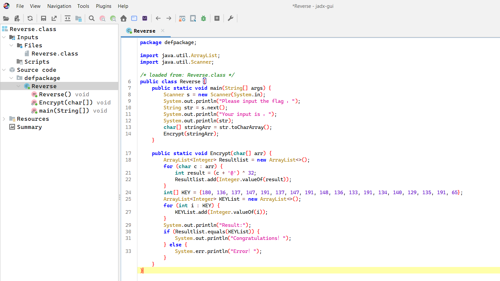

# Java逆向解密

- Mở file class trong jadx sẽ trích xuất được source code khá tường minh như sau:

- Flag chính là input cần nhập vào, sau đó bị mã hoá theo phép xor khá cơ bản

### Solve:
```
# from math import abs
key = [180, 136, 137, 147, 191, 137, 147, 191, 148, 136, 133, 191, 134, 140, 129, 135, 191, 65]

print('flag{', end='')
for i in key:
    print(chr((i^32) - ord('@')), end='')
print('}')

# flag{This_is_the_flag_!}
```

> **Flag:** flag{This_is_the_flag_!}