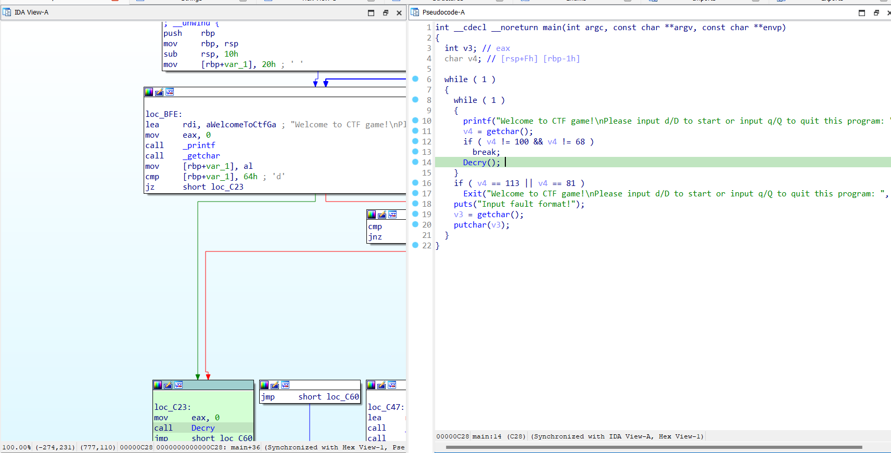
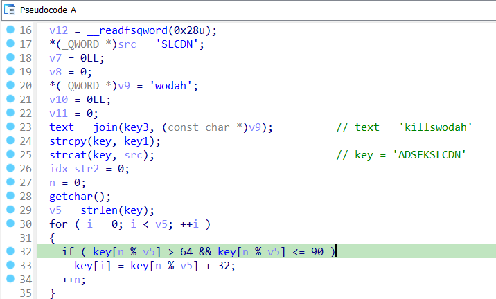
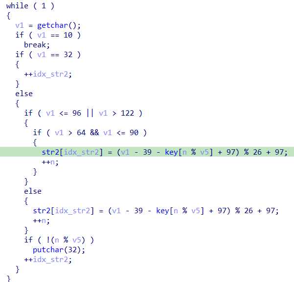
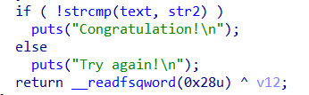

# SimpleRev

- Khi vừa load vào IDA chúng ta nhận được thông báo nhập `d/D` hoặc `q/Q` để tiếp tục hoặc kết thúc chương trình.

- Tuy nhiên luồng thực hiện chính của file thực thi này là ở hàm `Decry()`.
- Phần khởi tạo, các biến `text` và `key` lần lượt được gán giá trị `killswodah` và `adsfkslcdn`

- Tiếp theo chương trình yêu cầu nhập vào `flag`. Sau đó sẽ gán giá trị cho xâu str2.

- Cuối cùng sẽ kiểm tra `text` với giá trị xâu `str2` vừa được gán


## Solve:
```
text = 'killshadow'
key = 'adsfkndcls'
idx = 0
str2 = [0]*10
n = 10
flag = ''
while idx < 10:
    for i in range(0, 128):
        if ( i <= 96 or i > 122 ):
            if ( i > 64 and i <= 90 ):
                str2[idx] = (i - 39 - ord(key[n % len(key)]) + 97) % 26 + 97
        else:
            str2[idx] = (i - 39 - ord(key[n % len(key)]) + 97) % 26 + 97
        if chr(str2[idx]) == text[idx]:
            flag += chr(i)
            n += 1
            break
    idx += 1
print(flag)
```

> **Flag:** flag{KLDQCUDFZO}