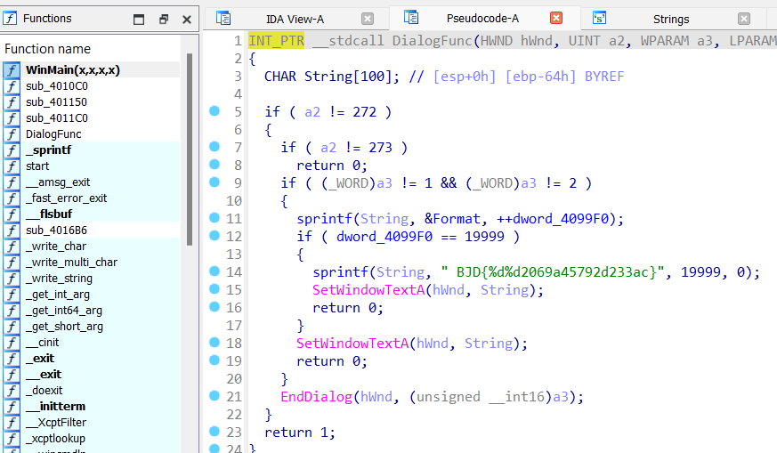

# [BJDCTF2020]JustRE

- Hàm thực hiện chính cần focus là hàm `DialogFunc`.
- Khi truy cập vào hàm đó ta sẽ thấy 1 xâu ký tự có dạng giống với flag.

- Lệnh `sprintf()` sẽ gán 1 xâu ký tự vào 1 biến theo đặc tả trong 2 dấu nháy kép, ở đây có 2 đặc tả `%d%d`, tương ứng phía sau có các số `19999` và `0`, ta chỉ cần thay thế 2 đặc tả `%d` thành 2 số này là ra flag.

> **Flag:** flag{1999902069a45792d233ac}