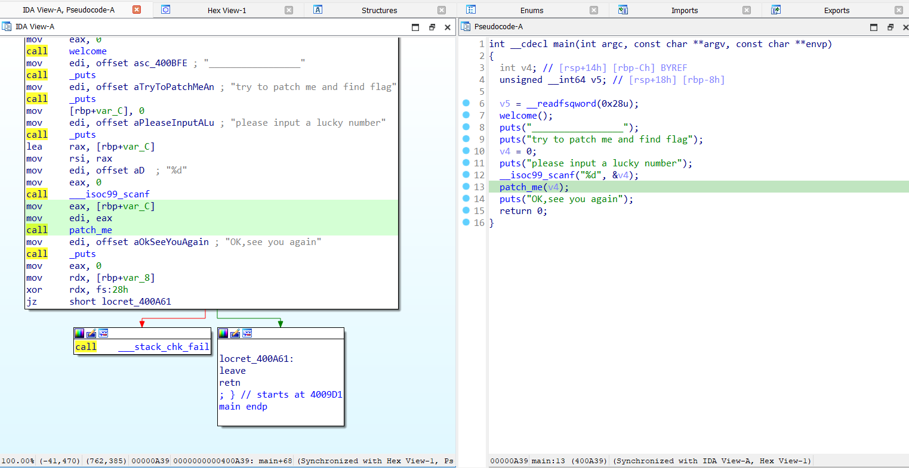
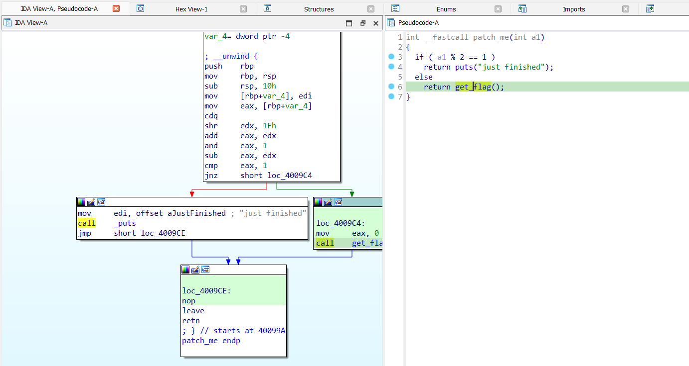
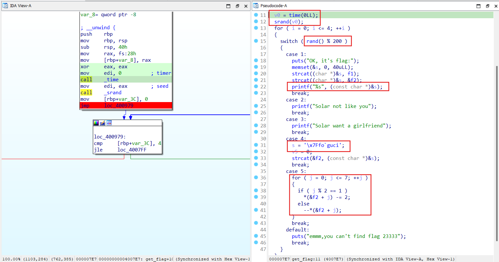
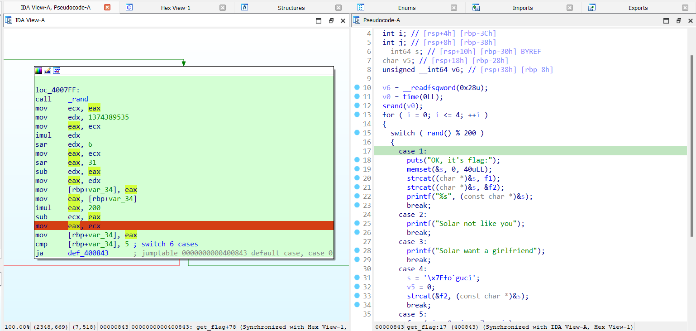
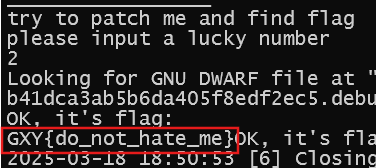

# [GXYCTF2019]luck_guy

- Sau khi load file vào IDA thì ta thấy được chương trình sẽ dẫn tới hàm `patch_me()`

- Tại đây, để vào được hàm chính và tìm được flag, cần nhập 1 số chẵn.

- Trong hàm `get_flag()` số random được sinh ra để làm điều kiện rẽ nhánh cho các tuỳ chọn phía sau.

- Hàm `rand()` lấy random 1 số nguyên theo thời gian thực, sau đó chia dư cho 200 để đưa vào khối rẽ nhánh `switch-case`, nếu chỉ chạy chương trình như bình thường thì rất khó để rẽ nhánh vào các case vì chỉ có 5 case đầu là thoả mãn in ra, nếu không thuộc 1 trong 5 case đó thì chương trình sẽ bị exit sau 4 lần hàm `random()` sinh số ngẫu nhiên.
- Nhìn vào các case nhận thấy case 2 và 3 khá vô dụng vì nó không ảnh hưởng gì đến flag. Ta chỉ cần để ý case 1, 4 và 5. Trong đó thấy case 4 có vẻ là đoạn khởi tạo cho flag, case 5 bắt đầu chỉnh sửa các ký tự trong flag và case 1 là ghép các chuỗi thành flag hoàn chỉnh. Lúc này chúng ta sẽ debug chương trình và chỉnh sửa thanh ghi `eax` theo thứ tự các case 4 -> 5 -> 1

- Sau khi debug xong chương trình, ta sẽ nhận được 1 chuỗi `GYX{do_not_hate_me}`. Tuy nhiên đây chưa phải flag cần nộp, đề bài yêu cầu sửa thành `flag{...}`

> **Flag:** flag{do_not_hate_me}