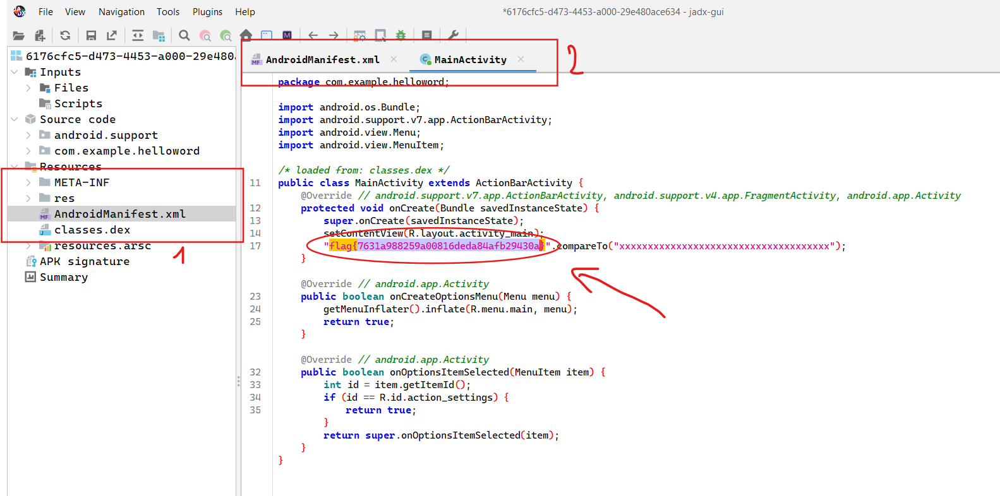

# helloword

- Đầu tiên mở file apk bằng tool jadx, tìm đọc file `AndroidManifest.xml` để biết luồng chương trình chính là class `MainActivity`.
- Tìm class `MainActivity`, thấy flag khá rõ ràng

> **Flag:** flag{7631a988259a00816deda84afb29430a}