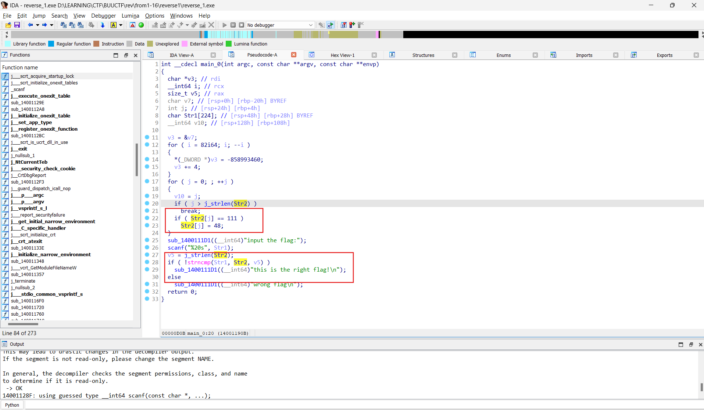

# reverse1

### **Solve:**

- Load file PE vào IDA và thực hiện tạo mã giả, thấy yêu cầu từ chương trình: Input flag đúng và in ra màn hình `this is the right flag!`

- Flag là chuỗi `Str2` được mã hoá theo cách: Nếu ký tự thứ i là ký tự 'o' thì sửa thành ký tự số '0'. Chuỗi `Str2` là '{hello_world}'. Ta chỉ cần sửa 'o' thành ký tự số '0' thì sẽ có được flag

> **flag:** flag{hell0_w0rld}