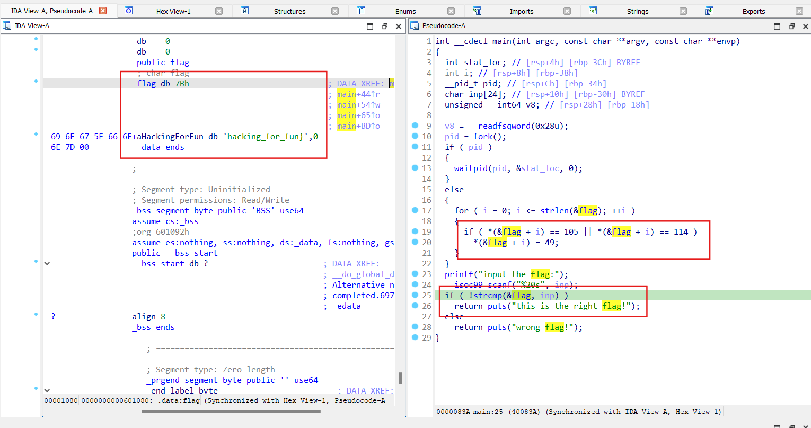

# reverse2

**Solve:**

- Chương trình yêu cầu nhập input là flag, sau đó kiểm tra với flag thật.

- Flag thật ban đầu là {hacking_for_fun}, sau đó đã bị mã hoá: chữ cái 'i' và 'r' sẽ được sửa thành '1'.

> **flag:** flag{hack1ng_fo1_fun}