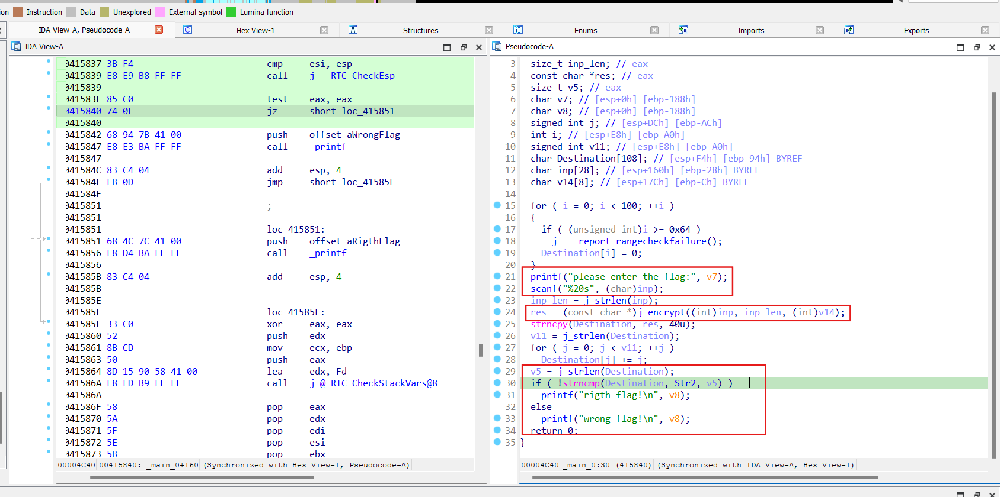
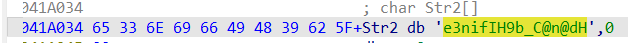
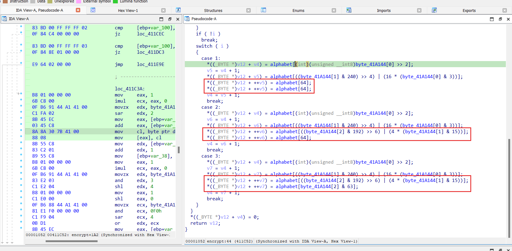

# reverse 3

## **[1]** Luồng chương trình chính:
- Nhập input
- Thông qua hàm mã hoá `encrypt` để mã hoá input
- Tiếp tục mã hoá với vòng for đơn giản
- Kiểm tra kết quả với chuỗi `Str2` được khởi tạo sẵn

## **[2]** Hàm encrypt:
- Hàm trả về giá trị của biến `v12`
- Chia thành các case phụ thuộc vào giá trị mà i được gán

- Các case lần lượt gán các giá trị cho biến `v12` với các giá trị trong bảng chữ cái `alphabet` tại các vị trí được tính toán bằng các phép thao tác với toán tử bit `>>`, `&`, `|`.

## **Solve:**
- Đầu tiên trừ từng ký tự trong xâu `Str2` cho chỉ số tương ứng của nó.
- Viết code giải mã tương ứng với các case sẽ tìm được flag `{i_l0ve_you}`
- Decryption: [solve](solve.c)

> **Flag:** flag{i_l0ve_you}