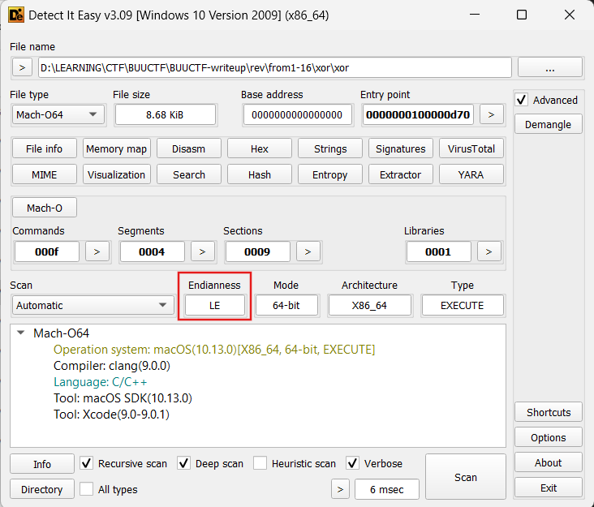
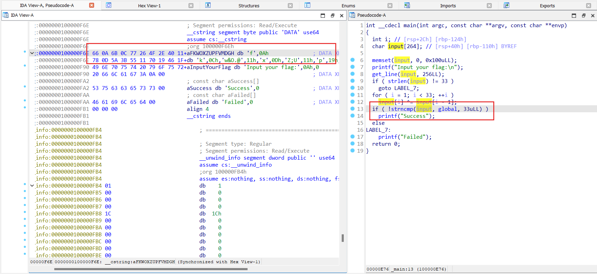

# xor

- Load file vào Detect It Easy thấy file này là file thực thi Mach-O64 ở dạng little-endian.

- Luồng chương trình bắt đầu tại hàm `main()`, đề bài yêu cầu nhập flag, sau đó từng ký tự sẽ xor với các ký tự đứng trước nó rồi so sánh với giá trị 1 mảng được khởi tạo từ trước.
- Biến `global` trỏ đến địa chỉ của biến `aFKWOXZUPFVMDGH`, click đúp vào biến này sẽ ra được các byte dữ liệu đã được khởi tạo sẵn

- Để tìm được flag chuẩn, chỉ cần export các byte này thành mảng các byte rồi xor ngược lại.

### Solve:
```
aFKWOXZUPFVMDGH = [
  0x66, 0x0A, 0x6B, 0x0C, 0x77, 0x26, 0x4F, 0x2E, 0x40, 0x11, 
  0x78, 0x0D, 0x5A, 0x3B, 0x55, 0x11, 0x70, 0x19, 0x46, 0x1F, 
  0x76, 0x22, 0x4D, 0x23, 0x44, 0x0E, 0x67, 0x06, 0x68, 0x0F, 
  0x47, 0x32, 0x4F
]

print(aFKWOXZUPFVMDGH)

print(chr(aFKWOXZUPFVMDGH[0]), end='')
for i in range(1, len(aFKWOXZUPFVMDGH)):
    print(chr(aFKWOXZUPFVMDGH[i] ^ aFKWOXZUPFVMDGH[i-1]), end='')

# flag{QianQiuWanDai_YiTongJiangHu}
```

> **Flag:** flag{QianQiuWanDai_YiTongJiangHu}